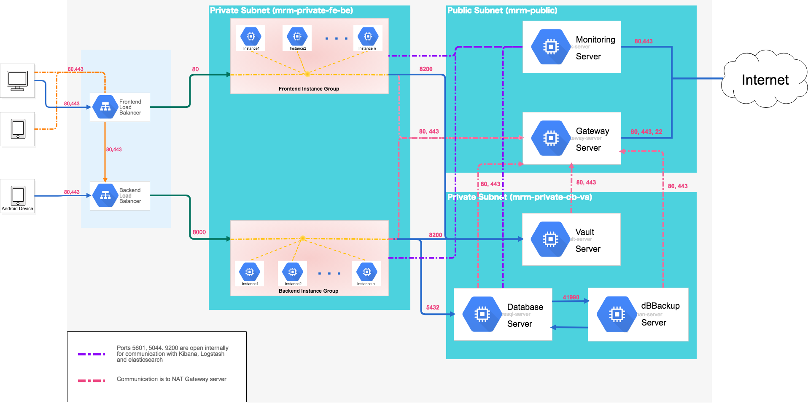

# Andela MRM Infrastructure

## Introduction

## Table of Content
- [Setup Service Account](./docs/service-account-creation)

- [Setup Terraform Infrastructure](./terraform/readme)
- [Setup/Build Packer Image](./images/readme)

- [Monitoring](./monitoring/readme)
- [Secret Management](./vault-image/readme)

- [Generate SSH Keys](./docs/private-key-generation)
- [Database Backup and Recovery](./images/database-image/readme)

## Technology Used

- [Terraform](https://www.terraform.io/)

- [Packer](https://www.packer.io/)

- [Vault](https://www.vaultproject.io/)

- [PostgreSQL](https://www.postgresql.org/)

- [Barman](http://www.pgbarman.org/)

- [CircleCI](https://circleci.com/)

- [Nginx](https://www.nginx.com/)

- [ELK](https://www.elastic.co/)
>- [Elasticsearch](https://www.elastic.co/products/elasticsearch)
>- [Kibana](https://www.elastic.co/products/kibana)
>- [Logstash](https://www.elastic.co/products/logstash)
>- [Metricbeat](https://www.elastic.co/products/beats/metricbeat)
>- [Filebeat](https://www.elastic.co/products/beats/filebeat)

## Before you begin

It is important that you [create a service account on GCP](docs/service-account-creation) and download the crediential file in json format

## Contributors

- [Fidelis Ojeah](https://github.com/fidelisojeah)

- [Chukwukadibia Durugo](https://github.com/daddychukz)
