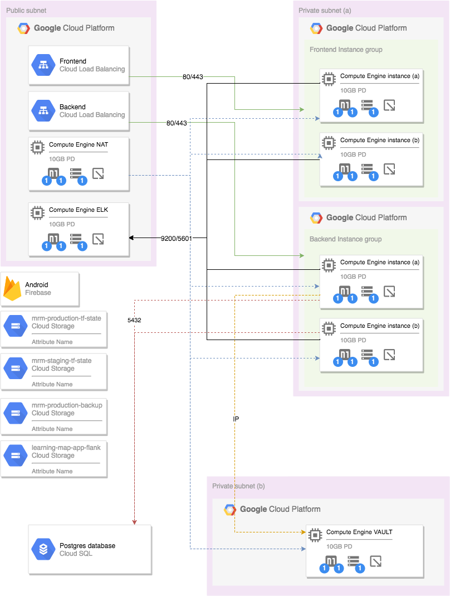

# Andela MRM Infrastructure

## Introduction

## Table of Contents
- [Setup Service Account](docs/service-account-creation.md)

- [Setup Terraform Infrastructure](terraform/README.md)
- [Setup/Build Packer Image](images/README.md)

- [Monitoring](images/monitoring/README.md)
- [Secret Management](images/vault-image/README.md)

- [Generate SSH Keys](docs/private-key-generation.md)
- [Database Backup and Recovery](images/database-image/README.md)

## Tools Used

- [Terraform](https://www.terraform.io/)

- [Packer](https://www.packer.io/)

- [Ansible](https://www.ansible.com/)

- [Vault](https://www.vaultproject.io/)

- [PostgreSQL](https://www.postgresql.org/)

- [Barman](http://www.pgbarman.org/)

- [CircleCI](https://circleci.com/)

- [Nginx](https://www.nginx.com/)

- [ELK](https://www.elastic.co/)
>- [Elasticsearch](https://www.elastic.co/products/elasticsearch)
>- [Kibana](https://www.elastic.co/products/kibana)
>- [Logstash](https://www.elastic.co/products/logstash)
>- [Metricbeat](https://www.elastic.co/products/beats/metricbeat)
>- [Filebeat](https://www.elastic.co/products/beats/filebeat)

## Before you begin

It is important that you [create a service account on GCP](docs/service-account-creation) and download the crediential file in json format. Install Ansible, Terraform and Packer.

In the root folder there are two scripts, `script_linux.sh` and `script_mac.sh`. As implied by their respective names, script_linux.sh is used on `Linux` systems while script_mac.sh is used on `Mac` systems. 

The purpose of these scripts is to create files from templates. The templates in this repository have an extension `.templ`. They require the specific environment files containing the values of the variables that exist in template files.

The scripts can further be used to run packer to create images and terraform scripts to create, update or destroy the infrastructure.

The difference between the script_linux.sh and script_mac.sh is mainly caused by [sed](https://www.gnu.org/software/sed/manual/sed.html). There are significant differences between [Linux (GNU) and Mac (BSD)](https://ponderthebits.com/2017/01/know-your-tools-linux-gnu-vs-mac-bsd-command-line-utilities-grep-strings-sed-and-find/) which lead to such a separation of concerns.

To use the MAC script, install [gnu-sed](https://stackoverflow.com/a/34815955/4896913) or else use an Ubuntu docker container, install all tools and run using the linux script. However, in that case the text editor will be vim, nano, emacs or any other editor of sorts.

The scripts expect a series of arguments in order to orchestrate a series of commands.

	source script_linux.sh <environment> <command1> <subcommand1>...<option>
    
The anatomy

	<enviroment>    -> sandbox, staging OR production
	<command1>      -> create, clean, packer OR terraform
	<subcommand1>   -> This must be pertaining to <command1>. Further explained below
	<option>        -> yes, y, Y OR no, n, N [Option to new create files from templates] 

### Creating Images
The infrastructure requires custom images to make the deployment of the application faster. The custom images created include, 

- [backend-image](https://github.com/andela/mrm-deployment-scripts/tree/develop/images/backend-image)
- [frontend-image](https://github.com/andela/mrm-deployment-scripts/tree/develop/images/frontend-image)
- [monitoring](https://github.com/andela/mrm-deployment-scripts/tree/develop/images/monitoring)
- [nat-image](https://github.com/andela/mrm-deployment-scripts/tree/develop/images/nat-image)
- [vault-image](https://github.com/andela/mrm-deployment-scripts/tree/develop/images/vault-image)

#### Creating image files

The examples below use the script_linux.sh however, the same applies to script_mac.sh. The following commands will create the appropriate files from template files to execute the packer.

###### Creating files for all images
The command below will create all files for the images

`source script_linux.sh sandbox create image all`

###### Creating files for backend image

`source script_linux.sh sandbox create image backend`

###### Creating files for frontend image

`source script_linux.sh sandbox create image frontend`

###### Creating files for monitoring image

`source script_linux.sh sandbox create image elk`

###### Creating files for NAT image

`source script_linux.sh sandbox create image nat`

###### Creating files for Vault image

`source script_linux.sh sandbox create image vault`

#### Validate images
The files parse packer validate command to validate the scripts before building

###### Packer validate all images

`source script_linux.sh sandbox packer validate all y`

###### Packer validate backend image

`source script_linux.sh sandbox packer validate backend y`

###### Packer validate frontend image

`source script_linux.sh sandbox packer validate frontend y`

###### Packer validate monitoring image

`source script_linux.sh sandbox packer validate elk y`

###### Packer validate NAT image

`source script_linux.sh sandbox packer validate nat y`

###### Packer validate Vault image

`source script_linux.sh sandbox packer validate vault y`

#### Building images
The files parse packer build command to create images on GCP

###### Packer build all images

`source script_linux.sh sandbox packer build all y`

###### Packer build backend image

`source script_linux.sh sandbox packer build backend y`

###### Packer build frontend image

`source script_linux.sh sandbox packer build frontend y`

###### Packer build monitoring image

`source script_linux.sh sandbox packer build elk y`

###### Packer build NAT image

`source script_linux.sh sandbox packer build nat y`

###### Packer build Vault image

`source script_linux.sh sandbox packer build vault y`

***NOTE: All other packer commands can be parsed through the scripts***

### Infrastructure

The infrastructure is represented by code in terraform files. Below the scripts are used to parse commands to terraform. The following commands only affect the terraform directory

###### creating terraform scripts

The following command creates two scripts particularly under the terraform directory `terraform-init.templ` and `variables.tf.templ`

`source script_linux.sh sandbox terraform extract`

###### Initializing terraform
The backend configuration for terraform is parsed a file terraform-init which is created from `terraform-init.templ`

`source script_linux.sh sandbox terraform init -backend-config=terraform-init y`

###### Terraform plan

`source script_linux.sh sandbox terraform plan y`

###### Terraform apply

`source script_linux.sh sandbox terraform apply y`

###### Terraform destroy

`source script_linux.sh sandbox terraform plan y`

***NOTE: All other terraform commands can be parsed through the scripts***

#### Cleaning up
The command will remove all files created from the templates

`source script_linux.sh sandbox clean`

## Contributors

- [Fidelis Ojeah](https://github.com/fidelisojeah)

- [Chukwukadibia Durugo](https://github.com/daddychukz)
