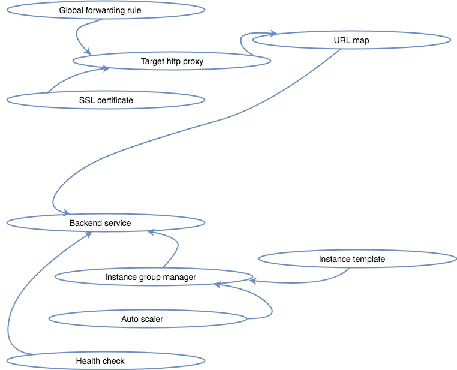

## Infrastructure with Terraform

The infrastructure is for converge is saved as code using terraform to run on Google Cloud Platform (GCP). The orchestration of the infrastruture is therefore also run by terraform. The infrastructure consists of two private subnet and one public subnet in a virtual private cloud (VPC). The first private subnetwork contains the frontend application instances and the banckend application instances while  the second private subnet contains the vault server. The public subnet on the other hand contains the NAT server and the ELK server. The NAT server exists in the public subnet essentially exposed to the internet to receive traffic. It however is used mainly for for two roles. It handles traffic originating from the application instances to the internet such as when a command like `sudo apt-get update` is run. In such a case, the IP address of the NAT instance is the one registered as if it is the one that requested, afterall the application servers do not have public IP addresses. The other role is for SSH-ing into all the instances that exist in private subnets, these include the application servers and the vault server. Other to application instances is handled by load balancers (discussed later). This only leaves the ELK server, meaining it is accessed directly on an entirely different subdomain.

### Traffic flow

Traffic to the frontend application on either production `http://converge.andela.com` or staging `http://converge-staging.andela.com` on is handeled by the frontend load balancer. The load balancing concept on Google Cloud Platform uses `forwarding rules` which directs traffic to specific `target pools` for load balancing or `target instances` for protocol forwarding. The forwarding rule is specified for an individual IP address to a either a target pool or target instance. The forwarding rules can be regional or global. This ties into what kind of external IP address is created and used to access the load balancers. GCP has two types of external `IP addresses`, `regional` and `global`. The global external IP addresses are used by global forwarding rules. The global forwarding rules route traffic by IP address, port and protocol to a load balancing target proxy. Target proxies on the other hand can be used to reference more than one global forwarding rule. Target proxies forward incoming requests directly to backend services. They can also use URL maps to forward traffic based on URL to different backend services configured for specific requests. 

A URL map is used to forward traffic to production on `http://converge.andela.com` and staging on `http://converge-staging.andela.com` depending on the request received. When a browser requests for staging `http://converge-staging.andela.com` the URL map will send traffic to the staging backend service while traffic will be sent to the production backend service when production is requested. The [backend service](https://cloud.google.com/load-balancing/docs/backend-service) is a group of virtual machines, each configuration consists of a heath check, session affinity, backend service timeout. The components of a backend include an instance group, balancing mode and capacity setting. 

In the case of converge infrastructure, the backend service has a managed instance group with auto scaling. The balancing mode is based on CPU utilization. Autoscaling is configured at 70% CPU utilization.

The frontend application is along with the mobile application make requests ti the backend application. Requests to the backend application also got through the process as the frontend application. However the backend also parses on the requests as queries to database for defined amounts of data. The database used is a google managed SQL postagres database. By design, the database does not fall into any of the subnets that are created in the VPC. In fact, queries to that database are made through a public IP address on port `5432`
